# Prva vaja: Prvi koraki v okolju Xilinx Vivado

Xilinx Vivado je razvojno okolje za sintezo in analizo HDL-načrtov, namenjeno predvsem FPGA-jem in SoC-om podjetja Xilinx. Zagotavlja celovito okolje za vnos načrta, simulacijo, sintezo, implementacijo in razhroščevanje.

Za poletni semester 2025/26 uporabljamo Vivado 2025.1; za laboratorijske vaje pa so primerne tudi starejše različice.

## Prevzem 

Za namestitev obiščite: [Downloads (xilinx.com)](https://www.xilinx.com/support/download.html)

- Prenesite Windows Self Extracting Web Installer.

- Ob kliku boste pozvani k ustvarjanju Xilinx računa. Uporabite šolski e-poštni naslov in geslo. Vnesti boste morali naslov in nekaj dodatnih podatkov. Ta korak je formalnost za prenos brezplačne različice Vivado.

- Po prijavi v Xilinx kliknite Download za prenos Web Installerja.

- Ko je Web Installer prenesen, poiščite EXE datoteko v mapi »Downloads« in jo dvokliknite za zagon.
  
- Prenos Web Installerja je hiter (približno 1 minuta, ~200 MB). Dejanska namestitev Vivado pa traja dlje. Namestitveni program najprej prenese Vivado in nato izvede namestitev. Potrebovali boste približno 70 GB prostega prostora. Po koncu namestitve se nepotrebne datoteke samodejno odstranijo, končna velikost pa je približno 20 GB.

## Namestitev

- Kliknite na namestitveno datoteko. Ko vas Windows vpraša »Do you want to allow this app to make changes to your device?«, izberite Yes.
- Če vas opozori Windows Defender, kliknite Allow Access.

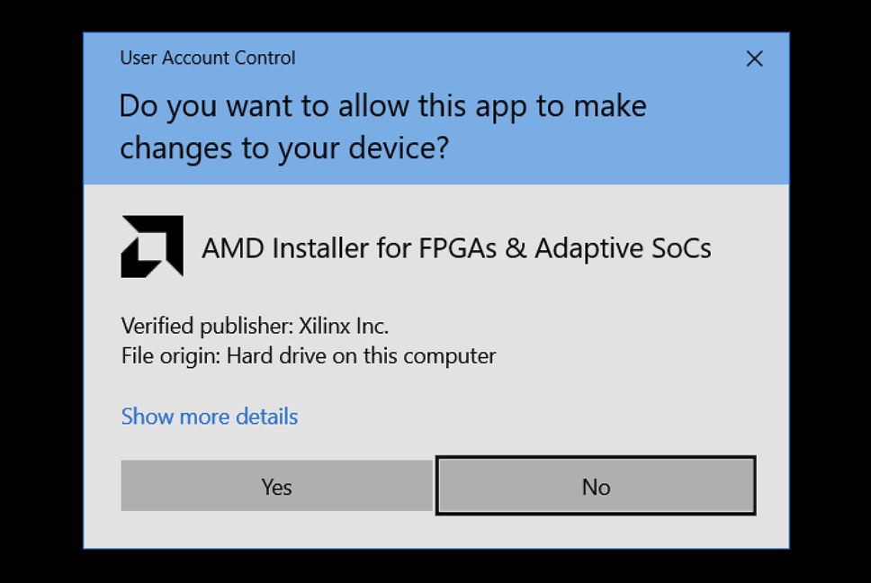

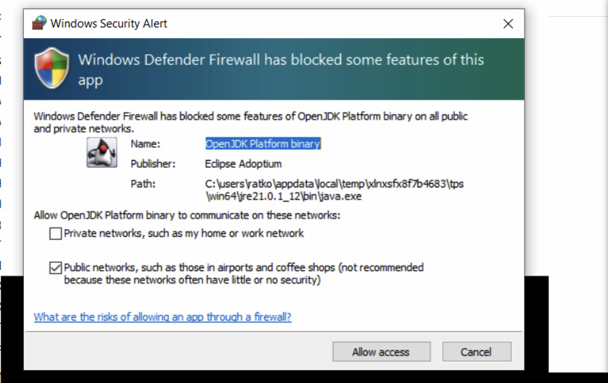

- Potem se prikaže Xilinx Unified Installer (npr. različica 2022.2). Kliknite Next.
- Izberite Download and Install. Vnesite e-pošto in geslo Xilinx računa. Kliknite Next.

- Izberite opcijo Vitis in kliknite Next.

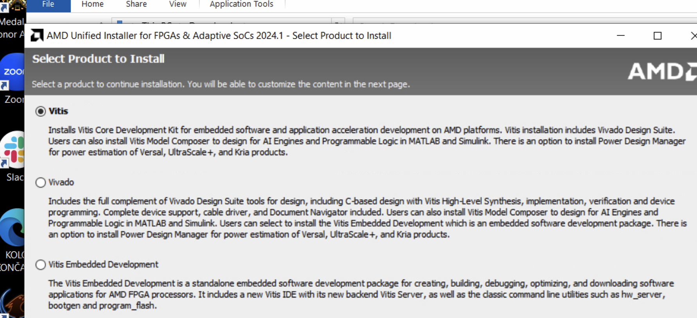

- V razdelku Devices izberite samo 7 Series in odznačite ostalo. Za laboratorijske vaje potrebujemo le ploščo Nexys A7.

- Namestitveni program bo prikazal napredek. Prenesel bo približno 20 GB podatkov in začel namestitev. Sledite privzetim možnostim. Po koncu boste na namizju našli ikoni Vivado in Vitis.

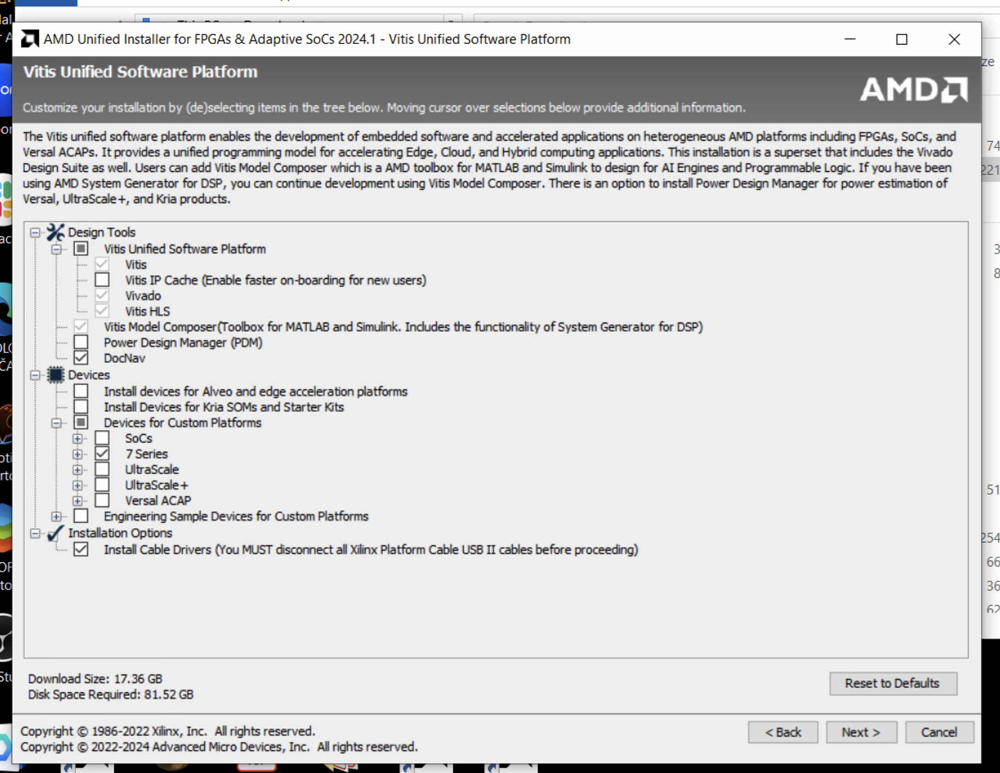

## Licenca (po potrebi)

- Odprite program Vivado 2025.1
- V meniju Help izberite Manage License… (Vivado License Manager)
 
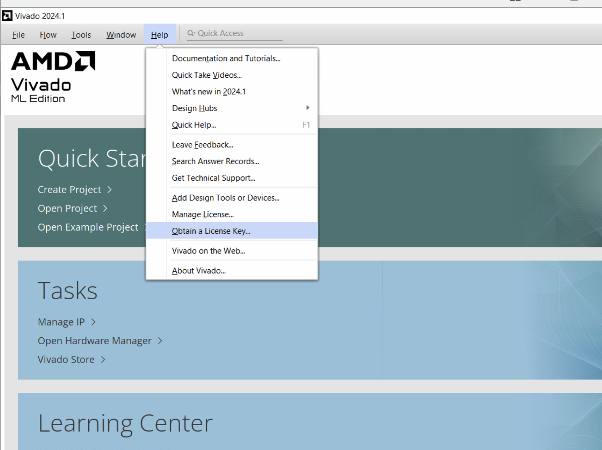

- V zavihku Get License izberite Obtain License → Get my Full or Purchased Certificate-Based License

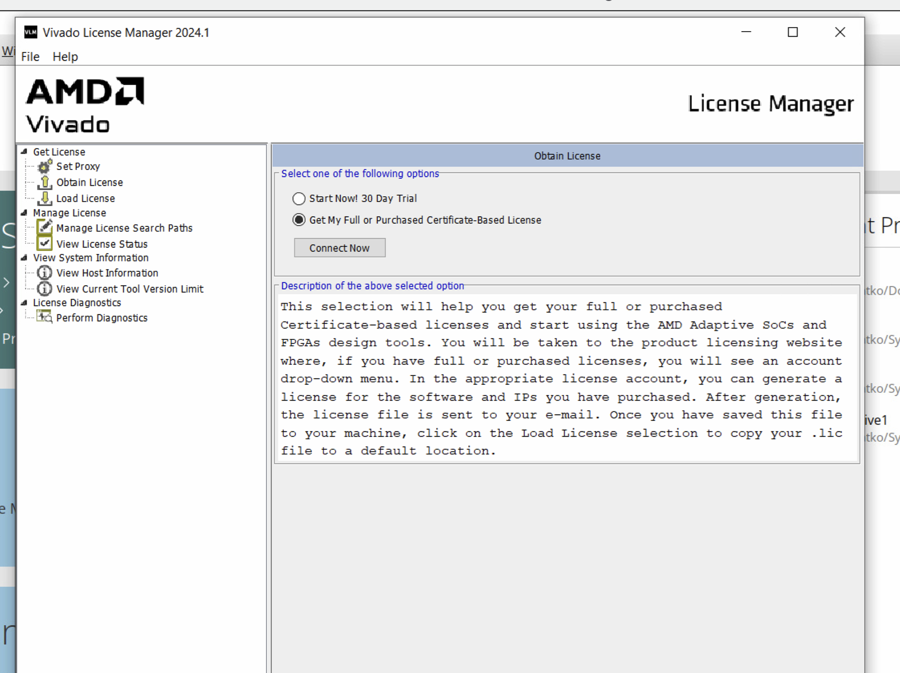

- Kliknite Connect Now in se prijavite na Xilinx Licensing Site. Na strani Product Licensing izberite Vivado Design Suite: HL WebPACK 2015 and Earlier License

- Kliknite Generate Node-Locked License in dokončajte postopek.
  
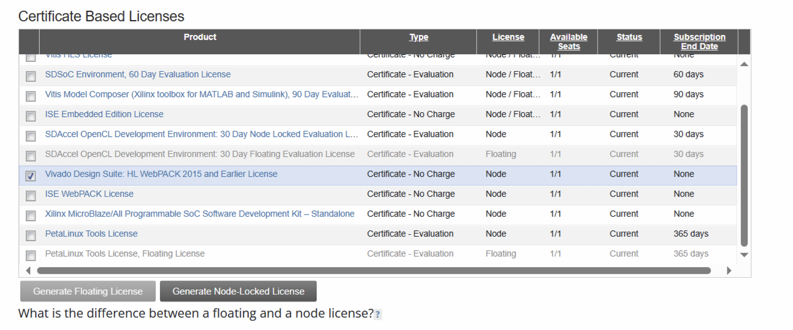

- Kliknite Generate Node-Locked License in dokončajte postopek.
- Kopijo licence boste prejeli po e-pošti ali jo prenesli na strani Manage Licenses.
- Datoteko licence (.lic) shranite na računalnik in zaženite Vivado License Manager.
- Kliknite Load License → Copy License in naložite datoteko .lic.
- Sedaj bi morali videti aktivirano licenco WebPACK. 

## Ustvarjanje prvega projekta

- Kliknite File → Project → New.

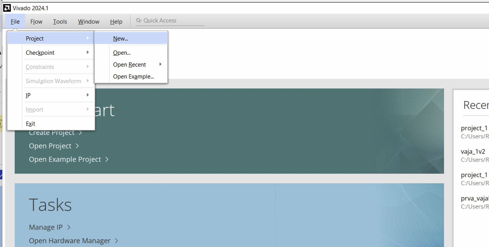

- Kliknite Next, poimenujte projekt in izberite mapo

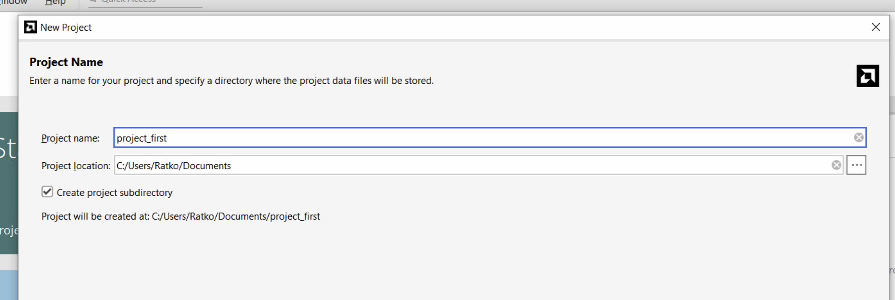

- Izberite RTL project. Če še nimate izvornih datotek, izberite Do Not Specify Sources at this time. 

- Izberite čip FPGA:

    - Category: General-Purpose 
    - Family: Artix-7 
    - Package: csg324
    - Speed: -1
    - Then select part xc7a7100tcsg324-1 for 100T version of Nexys A7, Nexys DDR 4, or NEXYS 4 or xc7a750tcsg324-1 for 50T version of Nexys A7

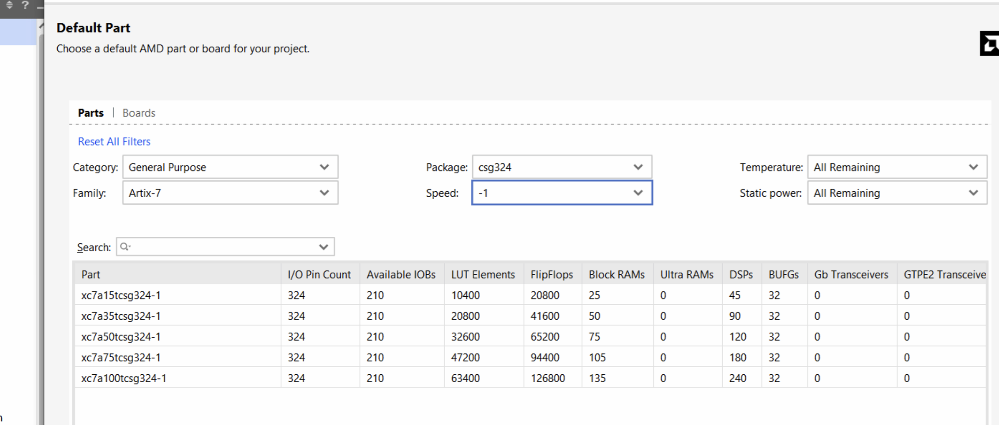

- Kliknite Finish 

## Implementacija prvega načrta v Vivado

- V oknu Sources ustvarite datoteke.

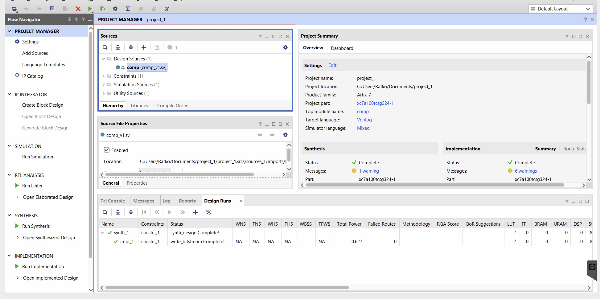

- Desni klik na Design Sources → Add Sources → ustvarite datoteko tipa SystemVerilog.

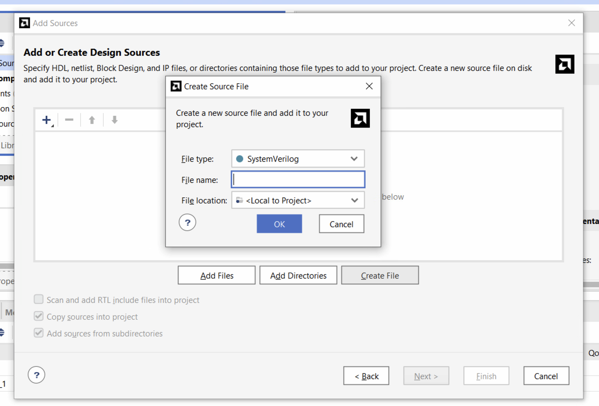

- Da dodate omejitve (constraints) [^1], desni klik na Utility Sources in ponovite postopek. Dodajte ustrezno datoteko .xdc glede na vašo ploščo:
  - [Nexys A7 50T](https://github.com/Digilent/digilent-xdc/blob/master/Nexys-A7-50T-Master.xdc), 
  - [Nexys A7 100T](https://github.com/Digilent/digilent-xdc/blob/master/Nexys-A7-100T-Master.xdc), 
  - [Nexys DDR4](https://github.com/Digilent/digilent-xdc/blob/master/Nexys-4-DDR-Master.xdc) or 
  - [Nexys 4](https://github.com/Digilent/digilent-xdc/blob/master/Nexys-4-Master.xdc)

[^1] Več o omejitvah: [Digilent reference](https://digilent.com/reference/programmable-logic/guides/vivado-xdc-file)

- Po uspešni implementaciji zaženite Generate Bitstream v zavihku Project Manager. (Leva stran okna Vivado)
  
- Za programiranje naprave odprite HW Manager → Open target → Auto connect.
   
- Nato kliknite Program device in izberite bitstream datoteko. 

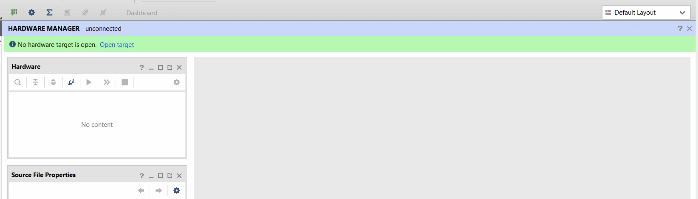

 
 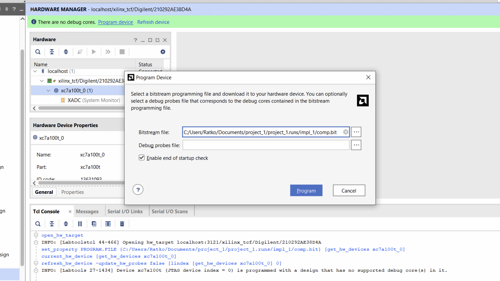

 - Čestitamo — uspešno ste programirali FPGA napravo.

 
 
 
 
 

 

