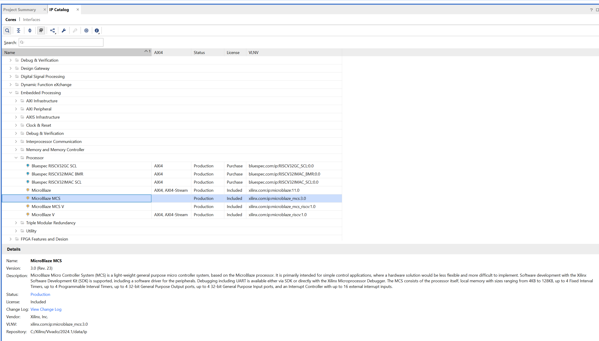
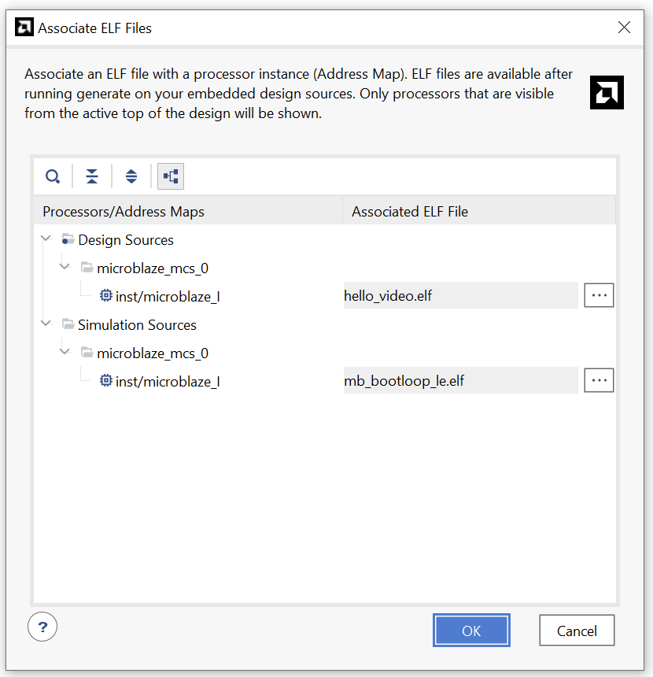

# Seventh laboratory exercise: Microblaze MCS tutorial 

In this exercise we will show how to integrate a Microblaze MCS core into a Vivado project and how to program it using Vitis SDK. 

## Step 1: Adding the Microblaze MCS core to the project

After creating a new project in Vivado, we need to add the Microblaze MCS core to the project. To do this, we need to follow these steps:

1. Click on the `IP Catalog` tab on the left side of the Vivado window. Alternatively, you can click on `Window -> IP Catalog`.

    

1. In the `IP Catalog` window, search for `Microblaze MCS` and double-click on it to add it to the project. Alternatively, you can find it under `Embedded Processing -> Processor -> Microblaze MCS`.

2. After you add the Microblaze MCS core to the project, you will be prompted to configure the core. You can configure the core according to your requirements. For this tutorial, we will use the following settings:
   - Clock frequency: 100 MHz
   - Memory size: 128 KB
   - Select Microblaze optimization: Area
   - Buses->Enable IO Bus: checked (Most important config)
   - Click `OK` to add the Microblaze MCS core to the project.

3. After that, the `Generate Output Products window` will appear. Click `OK` to generate the output products.  
   - Click `Generate` to generate the block design. 
4. After the block design is generated, you can see the Microblaze MCS core in the block design. However, the Microblaze MCS core is not connected to the rest of the system. To connect the Microblaze MCS core to the rest of the system, you need to adequately instantiate the Microblaze MCS core in your top-level HDL file.
    - In the subwindow `Sources`, click on the `IP Sources` tab. Expand the Microblaze MCS component and find instantation template inside `Instantion Template` source. Copy the instantiation template and paste it into your top-level HDL file. Note: `*.veo` file represents the instantiation template in Verilog language, while the `*.vho` file represents the instantiation template in VHDL language.

5. After you instantiate the Microblaze MCS core in your top-level HDL file and connect it to the rest of the system, you can generate the bitstream by clicking on `Generate Bitstream` in the `Flow Navigator` window.
6. After the bitstream is generated, you need to export the hardware design to Vitis SDK by clicking on `File -> Export -> Export Hardware`. Make sure to include the bitstream file in the export process. 
   - This will generate a `.xsa` file that will be used in the Vitis SDK project.
  

## Step 2: Creating a new application project in Vitis SDK

The previous steps were related to the hardware design. Now, we will create a new application project in Vitis SDK to program the Microblaze MCS core. To do this, follow these steps:

1. Open Vitis IDE and select the workspace where you want to create the new application project.
    - the workspace is a directory where the Vitis SDK stores the projects and other files.
2. Next, we need to create a platform project. A platform project provides hardware information and a software runtime environment. It is customizable; you can add domains and modify domain settings. A platform project can be created by importing an XSA, or by importing an existing platform. Several system projects can be built on the same platform project so that hardware and software environment settings can be shared. Source [Vivado Guide](https://docs.amd.com/r/2022.2-English/ug1400-vitis-embedded/Workspace-Structure-in-the-Vitis-Software-Platform)
   - Click on `File -> New Component -> Platform` and the `Create Platform Component` window will appear. Give the project a name and click `Next`.
   - In the following window, click on `Browse` and select the `.xsa` file that was exported from Vivado. Click `Finish` to create the platform project.
   - Now, you have created a platform project that contains the hardware information for the Microblaze MCS core.
    

3. Next, we need to create an application project. An application project is a software code that runs on a specific platform. It contains the software application and the hardware information. 
   - Click on `File -> New Component -> Application` and the `New Application Project` window will appear.
   - In the following window `Hardware`, select the platform project that you created in the previous step. Click `Next`.
   - In the next window `Domain`, select existing domain and click `Next`.
  
    

4. The application project will be created, and you can see the source files in the `src` directory. You can modify the source files to add your own functionality.

5. To build the application project, right click on the created project and select `Build Project` icon in the toolbar. This will compile the source code and generate the necessary files for programming the Microblaze MCS core. 
    - Note: You can also build the project by clicking on `Project -> Build Project`.
    - By default, the output files will be stored in the `Debug` directory of the project.
      - The output files include the ELF file, which is the executable file that will be loaded onto the Microblaze MCS core.

## Step 3: Programming the Microblaze MCS core

After building the application project, we need to program the Microblaze MCS core with the generated ELF file. To do this, we need to go back to Vivado and follow these steps:

1. Open the Vivado project that contains the Microblaze MCS core.
2. Click on `Tool -> Associate ELF Files` to associate the ELF file generated by Vitis SDK with the hardware design.
   - Note: We will effectively copy the ELF file into the memory of the Microblaze MCS core. This will allow the Microblaze MCS core to execute the code stored in the ELF file.
3. In the `Associate ELF Files` window under the `Design Sources`, click on `Add` and select the ELF file that was generated by Vitis SDK. Click `OK` to associate the ELF file with the hardware design
   
   

4. After associating the ELF file, you can generate the bitstream by clicking on `Generate Bitstream` in the `Flow Navigator` window.
   - Note: Every time you change the software application, you need to re-generate the bitstream to program the Microblaze MCS core with the updated software application. 

5. After the bitstream is generated, you can program the FPGA with the bitstream by clicking on `Program Device` in the `Flow Navigator` window. This will program the Microblaze MCS core with the software application that was generated by Vitis SDK.
